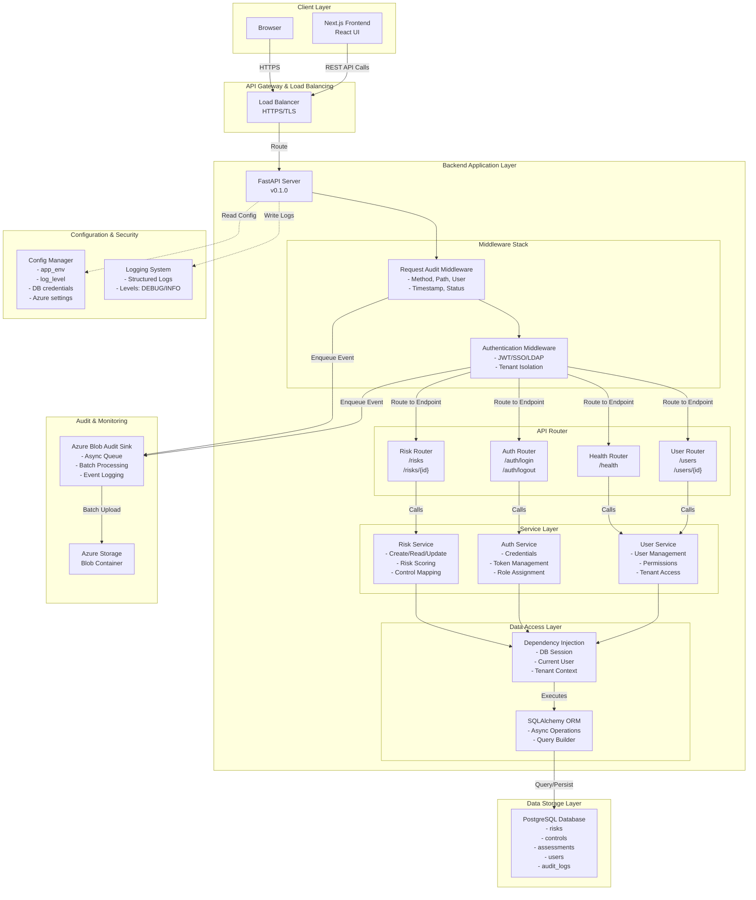
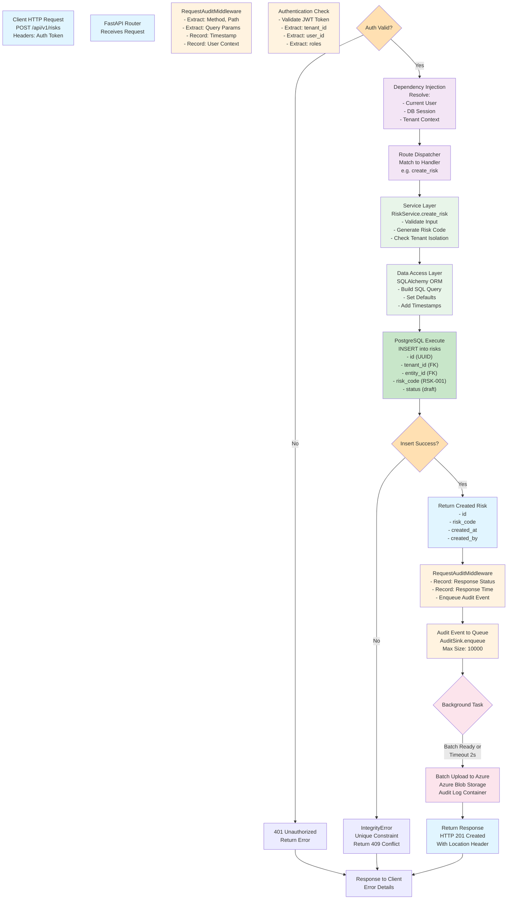
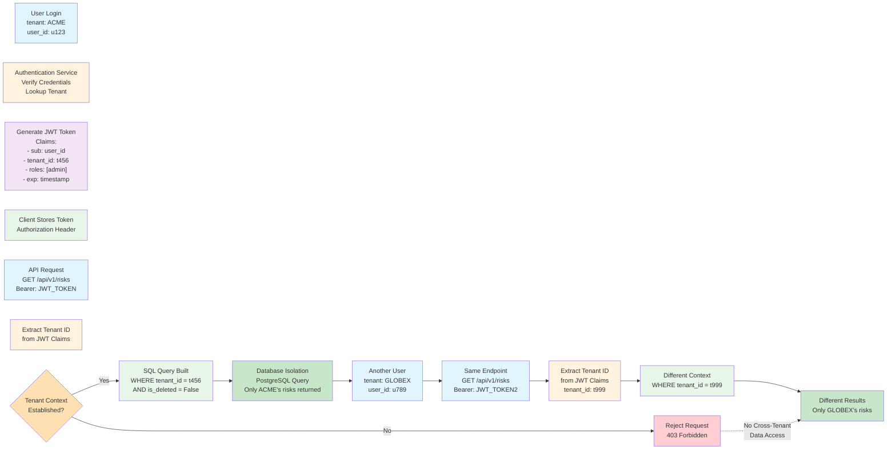
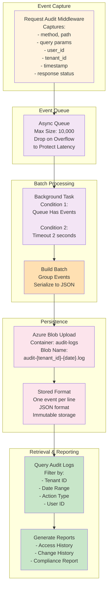
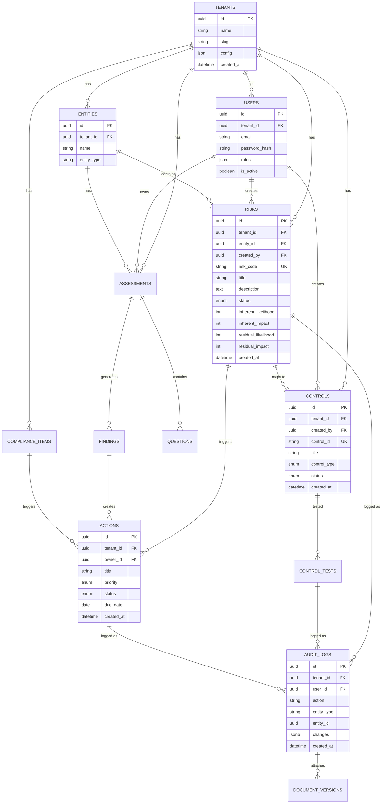

# GRC Intelligence Platform - Architecture & Workflow Diagrams

## 1. System Architecture Overview

---

## 2. Backend Request Processing Workflow

---

## 3. Multi-Tenant Data Isolation Workflow

---

## 4. Risk Management Data Governance Workflow

```mermaid
graph TB
    subgraph "Risk Creation & Governance"
        A["Risk Identification<br/>- Process Owner<br/>- Risk Category<br/>- Risk Type"]
        
        B["Create Risk Record<br/>Service: RiskService<br/>- Generate Risk Code<br/>- Set Inherent Score<br/>- Link Controls"]
        
        C["Risk Status: DRAFT<br/>Fields:<br/>- risk_code: RSK-001<br/>- status: draft<br/>- created_by: user_id<br/>- created_at: timestamp"]
    end

    subgraph "Risk Assessment"
        D["Assess Risk<br/>- Inherent Likelihood<br/>- Inherent Impact<br/>- Calculate Score"]
        
        E["Review & Approve<br/>Maker-Checker<br/>- Reviewer validates<br/>- Sets status: approved"]
        
        F["Risk Status: APPROVED<br/>- inherent_score<br/>- reviewed_by: reviewer_id<br/>- reviewed_at: timestamp"]
    end

    subgraph "Control Mapping & Testing"
        G["Map Controls<br/>Link risks to controls<br/>- Select Control<br/>- Define Effectiveness"]
        
        H["Conduct Control Test<br/>- Test Evidence<br/>- Test Date<br/>- Evaluator"]
        
        I["Assess Effectiveness<br/>- Design Effective?<br/>- Operating Effective?<br/>- Calculate Residual Score"]
    end

    subgraph "Risk Monitoring"
        J["Calculate Residual Risk<br/>Service Logic:<br/>- Residual Likelihood<br/>- Residual Impact<br/>- Residual Score"]
        
        K["Generate Risk Heatmap<br/>Dashboard Widget:<br/>- Likelihood vs Impact<br/>- Color Coded"]
        
        L["Trigger Alerts<br/>- Score Threshold Breach<br/>- Test Due<br/>- Overdue Action"]
    end

    subgraph "Action Management"
        M["Create Mitigation Action<br/>- Owner: manager_id<br/>- Due Date: target_date<br/>- Priority: HIGH/MED/LOW<br/>- Status: open"]
        
        N["Track Action Progress<br/>- Update Status<br/>- Add Evidence<br/>- Track Completion"]
        
        O["Close Action<br/>- Evidence Reviewed<br/>- Status: closed<br/>- closed_at: timestamp"]
    end

    subgraph "Audit & Compliance"
        P["Audit Trail Capture<br/>All Changes Logged:<br/>- Who: user_id<br/>- What: field + old/new value<br/>- When: timestamp<br/>- Why: action_type"]
        
        Q["Compliance Reporting<br/>Export Reports:<br/>- Risk Register PDF<br/>- Control Status<br/>- Open Actions"]
        
        R["Archive Closed Risks<br/>- Status: closed/archived<br/>- Retain History<br/>- Soft Delete: is_deleted"]
    end

    A --> B
    B --> C
    C --> D
    D --> E
    E --> F
    F --> G
    G --> H
    H --> I
    I --> J
    J --> K
    K --> L
    L --> M
    M --> N
    N --> O
    O --> P
    D -.->|Parallel| P
    E -.->|Parallel| P
    H -.->|Parallel| P
    P --> Q
    Q --> R

    style A fill:#e3f2fd
    style B fill:#fff3e0
    style C fill:#c8e6c9
    style D fill:#e3f2fd
    style E fill:#f3e5f5
    style F fill:#c8e6c9
    style G fill:#e3f2fd
    style H fill:#e3f2fd
    style I fill:#e3f2fd
    style J fill:#fff3e0
    style K fill:#f3e5f5
    style L fill:#ffcdd2
    style M fill:#e3f2fd
    style N fill:#fff3e0
    style O fill:#c8e6c9
    style P fill:#ffe0b2
    style Q fill:#f3e5f5
    style R fill:#c8e6c9
```

---

## 5. Backend Data Flow: Risk Service Operations

```mermaid
graph TD
    subgraph "Create Risk"
        C1["RiskService.create_risk<br/>Input: RiskCreate<br/>- title<br/>- description<br/>- risk_type<br/>- category"]
        
        C2["Generate Risk Code<br/>_next_risk_code<br/>Query: SELECT MAX<br/>FROM risks<br/>WHERE risk_code LIKE RSK-%"]
        
        C3["Prepare Risk Object<br/>- id: uuid.uuid4<br/>- tenant_id: from context<br/>- entity_id: from context<br/>- risk_code: RSK-001<br/>- created_at: now<br/>- created_by: actor_id<br/>- status: draft"]
        
        C4["Persist to Database<br/>session.add(risk)<br/>session.flush<br/>session.commit"]
        
        C5["Return: Risk Object<br/>with all fields populated"]
    end

    subgraph "List Risks"
        L1["RiskService.list_risks<br/>Input: tenant_id, page, page_size"]
        
        L2["Build Base Query<br/>SELECT * FROM risks<br/>WHERE tenant_id = ?<br/>AND is_deleted = False"]
        
        L3["Get Total Count<br/>SELECT COUNT<br/>For pagination info"]
        
        L4["Apply Pagination<br/>OFFSET: (page-1) * size<br/>LIMIT: page_size<br/>ORDER BY: created_at DESC"]
        
        L5["Execute Query<br/>Return: list[Risk], total_count"]
    end

    subgraph "Get Single Risk"
        G1["RiskService.get_risk<br/>Input: tenant_id, risk_id"]
        
        G2["Build Query<br/>WHERE id = risk_id<br/>AND tenant_id = tenant_id<br/>AND is_deleted = False"]
        
        G3["Execute Query<br/>Return: Risk | None"]
    end

    subgraph "Update Risk"
        U1["RiskService.update_risk<br/>Input: RiskUpdate<br/>- Only provided fields"]
        
        U2["Fetch Existing Risk<br/>Validate ownership<br/>Check tenant_id"]
        
        U3["Apply Updates<br/>Update only non-null fields<br/>- title, description<br/>- likelihood, impact<br/>- status"]
        
        U4["Update Metadata<br/>- updated_at: now<br/>- updated_by: actor_id"]
        
        U5["Persist Changes<br/>session.add<br/>session.commit"]
    end

    subgraph "Delete Risk - Soft Delete"
        D1["RiskService.delete_risk<br/>Input: tenant_id, risk_id"]
        
        D2["Fetch & Validate Risk<br/>Check ownership<br/>Check tenant_id"]
        
        D3["Soft Delete<br/>is_deleted: True<br/>deleted_at: now<br/>deleted_by: actor_id"]
        
        D4["Commit Changes<br/>Risk still in DB<br/>Filtered by is_deleted in queries"]
    end

    C1 --> C2
    C2 --> C3
    C3 --> C4
    C4 --> C5
    
    L1 --> L2
    L2 --> L3
    L3 --> L4
    L4 --> L5
    
    G1 --> G2
    G2 --> G3
    
    U1 --> U2
    U2 --> U3
    U3 --> U4
    U4 --> U5
    
    D1 --> D2
    D2 --> D3
    D3 --> D4

    style C1 fill:#e3f2fd
    style C2 fill:#fff3e0
    style C3 fill:#f3e5f5
    style C4 fill:#e8f5e9
    style C5 fill:#c8e6c9
    
    style L1 fill:#e3f2fd
    style L2 fill:#fff3e0
    style L3 fill:#fff3e0
    style L4 fill:#f3e5f5
    style L5 fill:#c8e6c9
    
    style G1 fill:#e3f2fd
    style G2 fill:#fff3e0
    style G3 fill:#c8e6c9
    
    style U1 fill:#e3f2fd
    style U2 fill:#fff3e0
    style U3 fill:#f3e5f5
    style U4 fill:#f3e5f5
    style U5 fill:#e8f5e9
    
    style D1 fill:#e3f2fd
    style D2 fill:#fff3e0
    style D3 fill:#ffcdd2
    style D4 fill:#e8f5e9
```

---

## 6. Audit Trail & Compliance Workflow

---

## 7. Database Schema - Key Relationships

---

## Backend Technology Stack Summary

| Layer | Technology | Purpose |
|-------|-----------|---------|
| **Framework** | FastAPI | Async REST API framework |
| **ORM** | SQLAlchemy | Async database operations |
| **Database** | PostgreSQL | Multi-tenant data storage with JSON/ARRAY support |
| **Authentication** | JWT/SSO/LDAP | Secure tenant isolation |
| **Middleware** | RequestAuditMiddleware | Request/response logging |
| **Audit Storage** | Azure Blob Storage | Immutable event log storage |
| **Dependency Injection** | FastAPI Depends | Request scoping, context management |
| **Config** | Pydantic Settings | Environment-based configuration |
| **Logging** | Python logging | Structured logging |
| **Deployment** | Multi-tenant SaaS | Cloud-ready architecture |

---

## Data Governance Principles Implemented

1. **Multi-Tenant Isolation**: Tenant ID enforcement at every query layer
2. **Audit Trail**: Complete change history via RequestAuditMiddleware
3. **Soft Deletes**: Data retention via `is_deleted` flag
4. **Maker-Checker**: Approval workflows for sensitive operations
5. **Role-Based Access**: JWT claims drive authorization
6. **Immutable Audit Logs**: Azure Blob storage for compliance
7. **Timestamp Tracking**: created_at, updated_at, deleted_at on all records
8. **Change Logging**: Actor ID + timestamp on every modification

